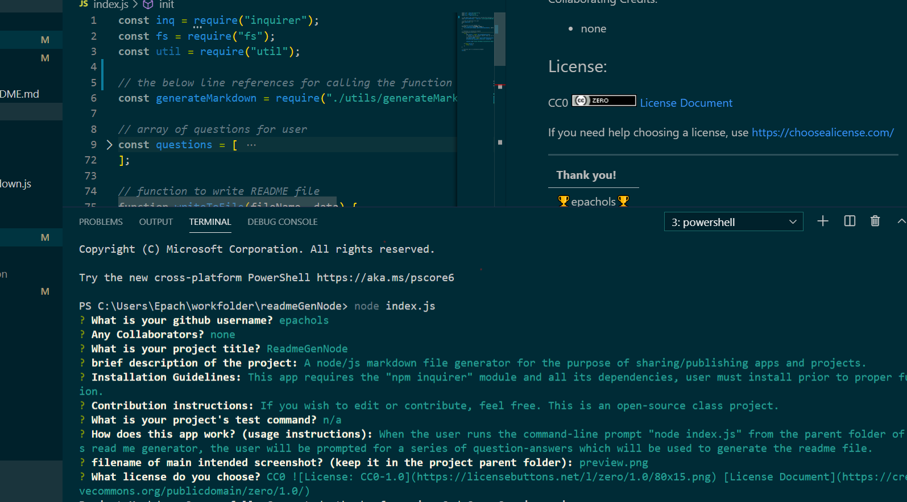

# ReadmeGenNode

  |      Table of Contents:       |
  |-------------------------------|
  | [Installation](#installation) |
  |      [Usage](#usage)          |
  | [Contributing](#contributing) |
  |     [Tests](#tests)           |
  |    [Questions](#questions)    |
  |    [Credits](#credits)        |
  |     [License](#license)       |
  
  ## Description
  
 a node/js readme generator
  
  ## Installation
  
 This app requires the "npm inquirer" module. Install before use within the parent folder by running the npm install inquirer command line.
  
  
  ## Usage 
  

  When the user runs index.js from node, they will be prompted for a series of question-answers which will then be used to generate a customized markdown file. 

  - 
 
  Demo Gif
  -   
  Demo Video Link
  [Demo mp4](demo.mp4)
  ## Contributing:
   
 Guidelines for contribution (if any): 

   Feel free!  
  
  
  ## Tests:
  Command for running tests for this app:
  
 n/a
  
  
  ## Questions:
  [epachols's Github](https://github.com/epachols/)
  
  
  ## Credits:
   Collaborating Credits:
  
 none
  
  ## License information:
  
 
  CC0  [License Document](https://creativecommons.org/publicdomain/zero/1.0/)
  
  [https://choosealicense.com/](https://choosealicense.com/)
  
  ---
  
  |Thank you!         |
  --------------------
  |&#x1F981;epachols&#x1F981;|
  